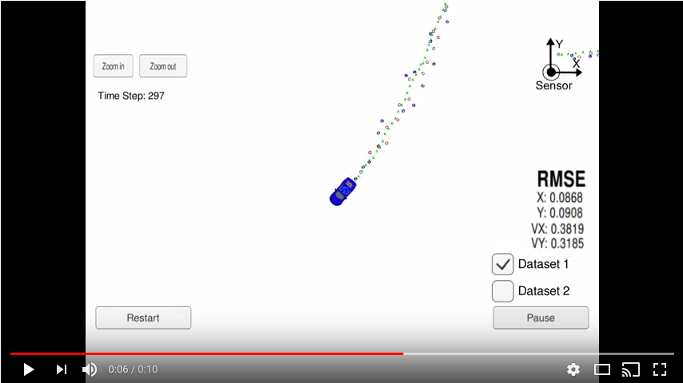

# Unscented Kalman Filter

This code utilize an Unscented Kalman Filter to estimate the state of a moving object of interest with noisy lidar and radar measurements.

A video of the Unscented Kalman Filter in action can be seen below.
[](https://www.youtube.com/watch?v=1qeJc94S9Qk)
---

## Prerequisites

* cmake >= 3.5
 * All OSes: [click here for installation instructions](https://cmake.org/install/)
* make >= 4.1
  * Linux: make is installed by default on most Linux distros
  * Mac: [install Xcode command line tools to get make](https://developer.apple.com/xcode/features/)
  * Windows: [Click here for installation instructions](http://gnuwin32.sourceforge.net/packages/make.htm)
* gcc/g++ >= 5.4
  * Linux: gcc / g++ is installed by default on most Linux distros
  * Mac: same deal as make - [install Xcode command line tools]((https://developer.apple.com/xcode/features/)
  * Windows: recommend using [MinGW](http://www.mingw.org/)

## Simulator

This project involves the Udacity Term 2 Simulator which can be downloaded [here](https://github.com/udacity/self-driving-car-sim/releases/tag/v1.0)

## Build Instructions

1. Clone this repo.

```sh
$ git clone https://github.com/Heych88/udacity-sdcnd-unscented-kalman-filter.git
```

2. This repository includes two files that can be used to set up and intall [uWebSocketIO](https://github.com/uWebSockets/uWebSockets) for either Linux or Mac systems. For windows you can use either Docker, VMware, or even [Windows 10 Bash on Ubuntu](https://www.howtogeek.com/249966/how-to-install-and-use-the-linux-bash-shell-on-windows-10/) to install uWebSocketIO.

Install [uWebSocketIO](https://github.com/uWebSockets/uWebSockets) by running the script

For Linux
`
bash install-ubuntu.sh
`

For Mac
`
sh install-mac.sh
`

3. ./UnscentedKF


If the above fails, install intall [uWebSocketIO](https://github.com/uWebSockets/uWebSockets) seperatly, then build and ran by doing the following from the project top directory.

1. mkdir build
2. cd build
3. cmake ..
4. make
5. ./UnscentedKF

## Running in the Simulator

The following assumes the **Build Instructions** was followed and produced no errors.

Download and extract the [simulator](https://github.com/udacity/self-driving-car-sim/releases/tag/v1.0).

1. Navigate to the extrated simulator directory and run the simulator.
2. Select the settings best for your computer and click **ok**.
3. In a terminal window run the UnscentedKF executable

```sh
$ cd <local directory>/udacity-sdcnd-unscented-kalman-filter
$ ./UnscentedKF
```

## License

This project is licensed under the MIT License - see the [LICENSE.md](LICENSE.md) file for details.
